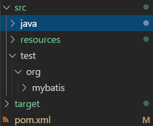

# 마이바티스

이번에 살펴 볼 것은 마이바티스의 기초 설정과 사용법 그리고 중급 사용법까지 설명 할 것입니다.

우리가 배울 마이바티스는 자바 퍼시스턴스 프레임워크의 하나로써 JDBC로 처리하는 상당부분의 코드와 파라미터 설정 및 결과 매핑을 대신해 줍니다.

아래와 같은 그림이 마이바티스의 전체적인 모양입니다.

<< 그림 1-1. mybatis architecture >>


먼저 전체적인 매퍼 프레임워크가 뭔지부터 살펴 보면서

차근 차근 마이바티스 구문을 살펴 보도록 하겠습니다.

## JDBC

JDBC(Java Database Connectivity)는 자바 데이터베이스를 연결하도록 지원하는 인터페이스로써 JDBC에서 전형적으로 사용되는(침투적인 코드) 코드가 많습니다.

아래 코드를 보면서 말해 보도록 하겠습니다.

[소스보기](./sources/001/step001.java)

이 코드는 데이터베이스와 접속 하기 위하는 jdbc의 고유 코드로써

이 행위를 통하여 데이터베이스에 접속하여 쿼리를 날려 처리 할 수 있는 것입니다.

따라서 이 모양은 쿼리를 보내는 순간 똑같이 유지 될 것입니다.

아래와 같이 말입니다.

[소스보기](./sources/001/step002.java)

select, update, insert, delete 등 모든 구문에서 데이터베이스에 접속 하는 구문이 있는 것을 확인 할 수 있습니다.

이 구문들은 공통화 되지 못한 관계로 작은 변경에도 큰 파동을 일으킬 수 있습니다.

(예로써 url의 host ip가 변경 될 경우 `DriverManager.getConnection`시 사용 되는 모든 구문이 변하여야 합니다.)

[소스보기](./sources/001/step003.java)

따라서 우리는 이 접속 정보를 추상화 할 필요가 생겼습니다.

### jdbc 접속 정보의 추상화

그러면 접속 정보를 추상화 해보도록 하겠습니다.

접속 정보는 아래와 같이 공통적으로 특정 한 행동을 하는 정보를 추출하여 분리 하는 것 부터 시작합니다.

우리는 클래스 드라이버를 로딩하고 Connection을 맷는 과정을 메소드 추출 방법을 통하여 `getConnection`으로 추상화 해 보도록 하겠습니다.

[소스보기](./sources/001/step004.java)

그 외에도 여러 방법을 사용하여 분리 할 수 있지만 이 장에서 설명할 범위에 벗어 나므로 넘어 가도록 하겠습니다.

### 설정 분리

이번에는 설정 정보를 사용하여 접속 시 처리 해 보도록 하겠습니다.

아래와 같이 설정 파일을 하나 만들어 봅니다.

[소스보기](./sources/001/step005.properties)

다음으로 실행 시 설정 파일을 불러 오도록 하겠습니다.

[소스보기](./sources/001/step006.java)

### SQL 분리

이번에는 SQL문을 분리 해 보도록 하겠습니다.

조회 하는 소스를 다시 한번 살펴 보겠습니다.

[소스보기](./sources/001/step007.java)

`prepareStatement`를 불러 오고 `SQL`에 파라미터를 매핑하여 실행 하는 것을 볼 수 있습니다.

먼저 SQL문을 외부로 분리 하여 보도록 하겠습니다.

파일을 하나 생성한 다음 SQL문을 등록 합니다.

[소스보기](./sources/001/step008.properties)

그런 다음 등록 한 SQL문을 로드 시 불러 오도록 합니다.

[소스보기](./sources/001/step009.java)

### Mapper 등장

이제 `executeQuery`를 실행하여 실행 결과 값을 반환 받을 수 있습니다.

이 `executeQuery` 문은 `ResultSet`을 반환하도록 작성 되어 있습니다.

따라서 쿼리문을 담아 보도록 하겠습니다.

그 전에 먼저 값을 담을 도메인을 하나 생성하여 보도록 하겠습니다.

[소스보기](./sources/001/step010.java)

이제 `ResultSet`을 실행 하는 코드를 추가해 보도록 하겠습니다.

[소스보기](./sources/001/step011.java)

매퍼 클래스를 만들어 보도록 하겠습니다.

[소스보기](./sources/001/step012.java)

(매퍼 클래스는 데이터베이스와 연결을 담당하고 `prepareStatement`에서 `SQL`을 불러 오고 `ResultSet`과 `shop`을 매핑해 주는 역활을 합니다.)

다음으로 `selectOne` 메서드를 생성해 보겠습니다.

기존 jdbc 소스를 사용하면 이렇게 사용 될 것입니다.

[소스보기](./sources/001/step013.java)

이번에는 좀 더 추상화 시켜 보도록 하겠습니다.

추상화 대상은 `Connection`에서 `PrepareStatement`를 추출하고 setObject로 값을 넣는 행동입니다.

[소스보기](./sources/001/step014.java)

다음 추상화 대상은 ResultSet 과 shop 객체를 묶는 행동을 추상화 해 보도록 하겠습니다.

그러기 위해서 먼저 인터페이스를 하나 생성하여 Mapping할 수 있도록 느슨하게 만들어 보겠습니다.

[소스보기](./sources/001/step015.java)

느슨하게 만들어진 인터페이스를 기반으로 추상화 대상을 처리 하는 함수를 하나 만들어 보겠습니다.

[소스보기](./sources/001/step016.java)

이제 가변 인자가 되는 항목들을 외부로 맞겨 모듈화를 해 보겠습니다.

[소스보기](./sources/001/step017.java)

실행 아래와 같이 실행 할 수 있습니다

[소스보기](./sources/001/step018.java)

고생하셨습니다.

이렇게 우리가 만든 클래스를 퍼시스턴스 계층을 담당하는 매퍼 프레임워크 라고 합니다.

마이바티스에서는 좀 더 활용적이고 범용 적으로 사용 할 수 있는 프레임워크를 제공하니 다음 장 부터는 마이바티스의 설정방법 부터

사용법까지 설명해 보도록 하겠습니다.

## 마이바티스 설정 파일

먼저 실행 할 정보를 확인 하기 위하여 데이터 베이스를 확인해 보도록 하겠습니다.

데이터베이스의 정보는 아래와 같습니다.

```s

> database information

driver   : oracle
url      : 13.209.118.27:1521/xe
username : ADMIN
password : ADMIN

```

다음으로 테이블을 보도록 하겠습니다.

```s

CREATE TABLE TB_USER (
    USER_ID NUMBER(5)     PRIMARY KEY,
    USER_NAME VARCHAR(50) NOT NULL,
    USER_ROLE CHAR(1)     NOT NULL,
    USER_GRADE VARCHAR(5) NOT NULL,
    USER_LOCATION VARCHAR(100)
)

```

이렇게 작성한 다음 데이터베이스에 접속 하여 테이블을 생성합니다.

<< 그림 1-2. oracle table create >>


테이블이 생성 된 것을 확인 한 다음 이제 자바로 돌아 가서 먼저 해당 테이블과 

그전에 먼저 프로젝트 구조를 정리 한 다음

매핑 되는 도메인을 생성해 보도록 하겠습니다.

프로젝트의 구조는 아래와 같습니다.

<< 그림 1-3. base structure >>


다음으로 maven을 추가 하여 프로젝트 구조를 등록해 보도록 하겠습니다.

[소스보기](./sources/002/002/pom.xml)

메이븐의 더 자세한 사항은 아래 링크를 참조 하세요.

[메이븐 빌드툴 정보](https://github.com/kim0lil/08501/blob/master/MAVEN.md)

다음으로 마이바티스 라이브러리와 jdbc라이브러리를 등록 합니다.  
(jdbc의 경우는 nexus를 이용할 것이며 오라클의 jdbc 라이브러리를 등록 하시면 됩니다.)

[소스보기](./sources/002/003/pom.xml)

이제 준비는 끝났습니다.

마이바티스의 설정 정보 부터 작성해 보도록 하겠습니다.

마이바티스의 설정을 등록 할 때에는 설정 파일을 생성합니다.

[소스보기](./sources/002/004/src/resources/mybatis/config/step001.xml)

다음으로는 먼저 데이터베이스와 연동할 데이터 소스를 등록 합니다.

데이터 소스는 `dataSource` 태그로 등록 합니다.  
(`dataSource`는 camelCase로 작성 되는 것을 잊지 마세요)

[소스보기](./sources/002/004/src/resources/mybatis/config/step002.xml)

`dataSource`에 연동 정보(driver, url, username, password)를 등록 합니다.

[소스보기](./sources/002/004/src/resources/mybatis/config/step003.xml)

다음으로 dataSource 를 커넥션을 관리할 `type`를 등록 합니다.

type은 아래와 같이 3종류의 타입으로 분리 합니다.

- - -

UNPOOLED : 디비 접속 요청이 있을 경우 실시간으로 커넥션 객체를 OPEN하고 CLOSE 합니다.
POOLED : 디비 접속 요청 이전 이미 커넥션을 만들어 두고 풀에 넣어 둔 다음 요청이 있을 경우 풀의 커넥션을 반환합니다.
JNDI : application에서 직접 데이터베이스 커넥션을 관리 할 떄 사용하며 설정 정보를 JNDI로 정의 한다는 뜻입니다.

- - -

우리는 `UNPOOLED` 타입으로 등록해 보도록 하겠습니다.

[소스보기](./sources/002/004/src/resources/mybatis/config/step004.xml)

이번에는 트랜젝션 관리를 위하여 `transactionManager`를 등록 하겠습니다.

(태그의 순서는 지켜야 오류가 나지 않습니다))

[소스보기](./sources/002/004/src/resources/mybatis/config/step005.xml)


`transactionManager`의 타입을 등록해 보도록 하겠습니다.

타입으로는 아래 jdbc에서 자동적으로 커밋을 관리하는 `JDBC`와 커밋과 롤백을 메뉴얼하게 하는 `MANAGED`가 있습니다.

우리는 맨 처음 커밋과 롤백을 메뉴얼 하게 작업할 예정이므로 `MANAGED`로 등록 합니다.

[소스보기](./sources/002/004/src/resources/mybatis/config/step006.xml)

우리가 작성한 dataSource와 transactionManager의 경우는 데이터베이스 접속을 위한 환경입니다.

애플리케이션 서버에서는 하나의 서버에 여러 환경에 존재 할 수 있으며

이 환경을 등록 하기 위하여 `environment`태그와 `environments`태그로 등록 합니다.

(각 `environment`는 고유한 `id`로 구분하기 떄문에 `environment`에는 `id`태그를 등록  하며 `environments`에서는 기본 환경을 `default` 속성을 통하여 등록 합니다.)

[소스보기](./sources/002/004/src/resources/mybatis/config/step007.xml)

이번에는 mapper를 등록해 보도록 하겠습니다.

mapper는 environment아래에 등록 합니다.

[소스보기](./sources/002/004/src/resources/mybatis/config/step008.xml)

다음으로 mapper.xml 파일을 생성하여 등록 합니다.

(mapper는 resources/mybatis/mapper 폴더에 생성 합니다.)

<< 그림 1-4. mapper folder >>


마이바티스 설정 파일에 매퍼를 등록합니다.

[소스보기](./sources/002/004/src/resources/mybatis/config/step009.xml)

매퍼는 하나 이상 등록 할 수 있으므로 mapper를 mappers로 감싸 줍니다.

[소스보기](./sources/002/004/src/resources/mybatis/config/step010.xml)

environment와 mapper를 묶어 하나의 설정(configuration을 만들어 줍니다.)

[소스보기](./sources/002/004/src/resources/mybatis/config/step011.xml)

xml 버전 정보와 mybatis dtd 를 등록합니다.

xml 버전은 경우 아래와 같이 등록합니다

```s
<?xml version="1.0" encoding="UTF-8"?>
```

dtd의 경우 mybatis 공식 사이트에서 배포 하고 있는 정보를 등록합니다.

```s
<!DOCTYPE configuration PUBLIC "-//mybatis.org/DTD Config 3.0//EN" "http://mybatis.org/dtd/mybatis-3-config.dtd">
```

[소스보기](./sources/002/004/src/resources/mybatis/config/step012.xml)

이번에는 mapper를 등록 해 보도록 하겠습니다.  

(* mapper를 변경할 예정이므로 추후 실행 시 마지막 ampper를 mapper의 resource로 등록 하여야 합니다.)

매퍼는 insert, update, delete, select 태그를 사용하여 등록 할 수 있습니다.

우리는 TB_USER 테이블을 조회 할 것이기 때문에 select태그를 사용해 등록 할 수 있습니다.

[소스보기](./sources/002/004/src/resources/mybatis/mapper/step002.xml)

각 태그(select, update, delete, insert)는 하나 이상 등록 할 수 있으므로 고유한 id를 지니고 있습니다.

이제 id 속성을 등록해 보겠습니다.

(id는 `select` + `Table명`으로 등록 합니다.)

[소스보기](./sources/002/004/src/resources/mybatis/mapper/step003.xml)

다음으로는 쿼리문을 등록합니다.

먼저 sqlplus에 접속 하여 쿼리문을 날려 보겠습니다.

<< 그림 1-5. select query execution >>


위와 같이 쿼리 결과가 나왔다면 쿼리를 select문 안에 등록 합니다.

[소스보기](./sources/002/004/src/resources/mybatis/mapper/step004.xml)

이제 도메인을 등록 해 보도록 하겠습니다.

현제 우리는 데이터베이스의 테이블과 자바의 클래스가 1:1 mapping 될 것이기 때문에

도메인은 java에서 등록 합니다.

<< 그림 1-6. tb_user domain class >>


도메인으로 TB_USER를 등록합니다.

[소스보기](./sources/002/004/src/java/org/mybatis/domain/TB_USER.java)

다시 mapper로 돌아 가서 타입을 매핑해 보도록 하겠습니다.

타입은 `resultType`과 `resultMap`이 있습니다.

- - -

resultType : 프로퍼티와 매핑할 구문이 일치할 경우 사용합니다.

resultMap : 프로퍼티와 매핑 할 구문이 일치하지 않을 경우 사용합니다.

두 타입의 자세한 차이는 뒤편에 나옵니다.

- - -

우선 resultType 으로 매핑해 보도록 하겠습니다.

[소스보기](./sources/002/004/src/resources/mybatis/mapper/step005.xml)

sql(select) 매핑 구문이 완성 되었습니다.

하나의 매퍼에는 여러 sql 매핑구문이 등록 될 수 있습니다.

따라서 mapper 태그를 사용하여 하나의 그룹으로 묶어 준 다음

매퍼 역시 여러 매퍼가 존재 할 수 있으므로 고유한 아이디(namespace)를 등록 합니다.

(namespace의 설정 기준이 없을 경우 `package명`+`파일 명`으로 등록 합니다. )

[소스보기](./sources/002/004/src/resources/mybatis/mapper/step006.xml)

이제 `xml`정보와 `mybatis`에서 제공하는 `mapper`구문이 정의 된 dtd를 등록해 보도록 하겠습니다.

```xml
<!DOCTYPE mapper PUBLIC "-//mybatis.org//DTD Mapper 3.0//EN" "http://mybatis.org/dtd/mybatis-3-mapper.dtd">
```

( dtd는 마이바티스 사이트에 방문하여 확인 할 수 있습니다. [사이트](https://mybatis.org/) )

[소스보기](./sources/002/004/src/resources/mybatis/mapper/step007.xml)

이제 실행 구문을 만들어 보도록 하겠습니다.

서비스 패키지에 새로운 클래스를 생성한 다음 아래와 같이 실행 구문을 등록 합니다.

실행 순서는 아래와 같습니다.

1. Resources와 config.xml 경로를 통하여 파일을 읽어 들이는 Reader를 반환 받습니다.
2. Reader 객체를 사용하여 SqlSessionFactory를 만듭니다.
3. 트랜젝션 발생 시에 SqlSessionFactory를 통하여 SqlSession을 생성합니다.
4. 쿼리를 실행하고 SqlSession의 commit rollback 구문을 통하여 쿼리를 처리 합니다.

SqlSessionFactory는 하나만 존재 하면 되므로 설정 클래스를 하나 만들어 두도록 하겠습니다.

[SqlManager 소스보기](./sources/002/004/src/java/org/mybatis/config/SqlManager.java)

이제 select 서비스를 하나 등록 하겠습니다.

[소스보기](./sources/002/004/src/java/org/mybatis/service/step001.java)

이제 이 서비스를 테스트할 test 프레임워크를 등록해 보도록 하겠습니다.

먼저 pom.xml에 junit의존성을 등록 합니다.

[소스보기](./sources/002/004/src/pom.xml)

다음으로 test를 실행할 테스트 리소스를 등록 합니다.

<< 그림 1-7. test resource >>



이제 pom.xml에 testSourceDirectory를 등록 합니다.

[소스보기](./sources/002/004/src/pom.xml)

테스트에 필요한 클래스를 하나 생성하여 테스트를 실행 합니다.

[소스보기](./sources/002/004/src/test/org/mybatis/MybatisTest.java)

메이븐 테스트를 실행하여 테스트 해 보겠습니다.

<< 그림 1-8. mvn test success >>


만일 same의 값을 바꾸면 아래와 같이 테스트가 실패 할 것입니다.

<< 그림 1-9. mvn test failure >>


이제 서비스를 추가해 보곘습니다.

추가할 서비스는 아래와 같습니다.

1. 전체 조회 - Mapper = selectAll_TB_USER, method = selectAll
2. 단건 조회 - Mapper = selectOne_TB_USER, method = selectOne
3. 입력      - Mapper = insert_TB_USER, method = insert
4. 수정      - Mapper = update_TB_USER, method = update
5. 단건 삭제 - Mapper = deleteOne_TB_USER, method = deleteOne
6. 전체 삭제 - Mapper = deleteALL_TB_USER, method = deleteAll

각 항목별 이름은 오른쪽에 있습니다.

이제 매퍼 부터 추가해 보도록 하겠습니다.

(파라미터도 parameterType와 parameterMap으로 등록 할 수 있습니다)

[소스보기](./sources/002/004/src/resources/mybatis/mapper/step008.xml)

- - -

이번에는 매핑 구문에 대하여 알아 보겠습니다.

mybatis의 매핑 구문은 크게 3가지가 있습니다.

타입(프로퍼티) 매핑, 값(파라미터) 매핑, 가칭 매핑

먼저 타입 매핑은 이런 식으로 사용 할 수 있습니다.

TB_USER라는 타입의 property 값으로 userId가 있다고 가정하면

```xml
<.. type="...TB_USER">
    SELECT ...
      FROM ...
     WHERE #{userId}
</..>
```

또는 

```xml
<.. type="...TB_USER">
    SELECT ...
      FROM ...
     WHERE ${userId}
</..>
```

둘의 차이는 preparestatement사용하여 sql injection에 대하여 방어할 수 있으니 `#{}` 구문을 우선시 합니다.

또한 `${}`구문은 쿼리 결과 문이 로그에 찍힌히기 때문에 보안상으로 불리한 점도 있습니다.

두번째로는 값을 직접 매핑하는 것입니다.


- - -

다음으로 서비스에 추가해 보도록 하겠습니다.

[소스보기](./sources/002/004/src/java/org/mybatis/service/step002.java)

이제 테스트를 추가해 보도록 하겠습니다.

[소스보기](./sources/002/004/src/test/org/mybatis/MybatisServiceTest.java)

다시 한번 테스트를 실행해 보도록 하겠습니다.

<< 그림 1-10. add on service mvn test failure >>


에러가 발행한 것을 확인 할 수 있습니다.

왜 조회 할 때 에러가 발생한 것일까요?

`selectOneTest`는 단순히 데이터베이스에 데이터를 한건 입력 한 다음 입력한 것을 조회 하여 동일 여부만을 확인한 것일 뿐입니다.

하지만 어떠한 이유에서인지 데이터를 한건만 조회가 불가능 한 상황입니다.

이전 `resultType`과 `resultMap`에 대하여 대충 설명한 것을 기억할 것입니다.

그렇다면 이제 다시 생각 해 보겠습니다.

현재 데이터베이스 상에 `TB_USER`의 스키마와 자바에서의 클래스는 아래와 같습니다.

<< 그림 1-11. TB_USER database schema and class project >>


왼쪽에는 자바의 도메인 클래스이며 오른쪽에는 데이터베이스의 스키마 입니다.

하지만 도메인 클래스는 CamelCase 구조를 따르고 있으며 데이터베이스의 스키마는 `_`을 기준으로 사용 되고 있는 것을 확인 할 수 있습니다.

따라서 자바의 프로퍼티와 데이터베이스의 스키마를 매핑해 줄 필요가 있습니다.

다행히 마이바티스에서는 이와 같은 일을 두가지 방법을 통하여 처리 할 수 있습니다.

1. resultMap을 통하여 동적 매핑
2. configuration의 기본 setting을 통하여 고정 매핑

동적 매핑 부터 사용해 보도록 하겠습니다.

resultType은 프로퍼티와 매핑 구문이 동일할 경우 사용한다고 말한적이 있었습니다.

하지만 지금과 같이 프로퍼티와 매핑 구문이 동일하지 않을 경우(userId <> USER_ID) 묵시적 또는 암시적으로 매핑해 줄 필요가 있습니다.

따라서 이때 resultMap을 사용합니다.

resultMap을 사용하기 위해서는 먼저 `resultMap`을 등록합니다.

[소스보기](./sources/002/004/src/resources/mybatis/mapper/step009.xml)

다음으로 기존의 `resultType`으로 등록 되어 있는 구문을을 `resultMap`으로 변경해 줍니다.

[소스보기](./sources/002/004/src/resources/mybatis/mapper/step010.xml)

다음으로는 매핑할 도메인 타입을 등록합니다.

해당 타입을 디비 스키마와 매핑할 것입니다.

[소스보기](./sources/002/004/src/resources/mybatis/mapper/step011.xml)

이제 `result` 태그을 사용하여 두 인자를 매핑 합니다.

`result`태그에는 자바 객체와 연결 할 `property`와 디비 컬럼에 매핑할 `column`으로 등록 합니다.

[소스보기](./sources/002/004/src/resources/mybatis/mapper/step012.xml)

마지막으로 키 값은 id로 지정하여 고유 정보를 유지 할 수 있습니다.

[소스보기](./sources/002/004/src/resources/mybatis/mapper/step013.xml)

이제 다시 한번 실행해 보도록 하겠습니다.

```
mvn clean test
```

<< 그림 1-12. test success >>


잘 실행 되는 것을 확인 할 수 있습니다.

이번에는 좀 다르게 매핑해 보도록 하겠습니다.

resultMap으로 동적 매핑하는 것이 아니라 setting을 통하여 모든 매핑을 정적으로 처리 할 수 있습니다.

이 방법은 마이바티스의 정적 매핑 시에 유용하게 사용 할 것입니다.

먼저 setting 태그를 등록 합니다.

[소스보기](./sources/002/004/src/resources/mybatis/config/step013.xml)

다음으로 설정값으로 `mapUnderscoreToCamelCase`을 true로 설정 합니다.

[소스보기](./sources/002/004/src/resources/mybatis/config/step014.xml)

설정에 관한 좀더 자세한 내용은 아래 공식 문서를 참조 하세요.

[링크](https://mybatis.org/mybatis-3/configuration.html#settings)

이제 기본적인 기능은 모두 알아 보았습니다.

다음부터는 좀더 심화하여 학습해 보도록 하겠습니다.

## 심화 학습

이번에는 마이바티스를 좀더 자세히 살펴 보도록 하겠습니다.

그 중 가장 먼저 마이바티스의 `Configuration`에 관하여 다루어 보도록 하겠습니다.

마이바티스의 `Configuration`은 마이바티스의 설정 파일로써 크게 아래 구문을 지니고 있습니다.

(태그의 순서는 꼭 지켜야 합니다.)

[소스보기](./sources/002/005/config/step001.xml)

각 항목에 관하여 알아 보면서 마이바티스의 기본 설정법에 관하여 알아 보겠습니다.

### properties

먼저 설정 정보를 등록하는 `properties`태그 입니다.

이 태그는 마이바티스 설정 시에 설정값을 등록해 두고 사용 할 수 있습니다.

프로퍼티를 등록 하는 방법으로는 외부 파일을 로드 하여 등록 하는 방법과 인라인으로 직접 등록 하는 방법이 있습니다.

#### properties-inline

프로퍼티를 인라인으로 등록 하는 방법은 아래와 같습니다.

`property` 태그를 사용하여 `name`과 `value`값을 등록 합니다.

[소스보기](./sources/002/005/config/properties/step001.xml)

이번에는 외부 파일을 로드하여 설정값을 등록해 보도록 하겠습니다.

외부 값을 불러 올떄에는 `resource` 태그를 사용하여 불러 올수 있습니다.

먼저 프로퍼티 파일을 생성하여 등록 합니다.

[소스보기](./sources/002/005/config/properties/datasource.properties)

다음으로 마이바티스 설정 파일에서 파일을 불러 옵니다.

[소스보기](./sources/002/005/config/properties/step002.xml)

마지막으로 클래스 로드 시에 설정값을 등록 할 수 있습니다.

우리가 이전에 사용했던 SqlSessionFactory를 만들 떄 properties를 추가 하여 등록 하면 됩니다.

[소스보기](./sources/002/005/config/properties/step003.java)

파일을 읽는 순서로는

1. 인라인으로 등록 한 설정 값
2. 인라인에서 외부 properties를 설정 한 설정 값
3. 세션 팩토리 생성시에 등록한 설정 값

### settings

다음으로는 세팅 정보에 관하여 다루어 볼 것입니다.

세팅 정보는 마이바티스에서 기본적으로 default 제공하지만 각 세팅을 등록하여

사용 할 수 있습니다.

(가령 우리가 보았던 `mapUnderscoreToCamelCase`와 같은 형식입니다.)

필요한 정보만을 다루 도록 하겠습니다. 

전체 정보는 소스를 확인 하세요

[소스보기](./sources/002/005/config/settings/step001.xml)

더 자세한 정보는 아래 링크를 확인하세요.

[링크](https://mybatis.org/mybatis-3/configuration.html#settings)

#### cacheEnabled

메퍼를 구성하는 캐시영역을 활성화 또는 비 활성화 하는 세팅입니다.

기본은 `true`로 등록 되며 너무 큰 오버헤드가 발생 시 또는 간략하게 테스트 목적일 경우 `false`로 등록 하여 실행합니다.

#### lazyLoadingEnabled

클래스 관계 설정이 최대한 느리게 로드 됩니다.

따라서 필요 하지 않는 관계 클래스는 로드는 하지 않으며 

매핑의 경우 필요 할 경우 로드 하게 됩니다.

기본은 `false`로 되어 있으며 `true`로 변경하여 사용할 수 있습니다.

#### defaultExecutorType

기본적인 실행 프로그램을 구성합니다.

defaultExecutorType 의 기본 값은 `SIMPLE`이며 

`SIMPLE`, `REUSE`, `BATCH`가 있습니다

`SIMPLE`는 실행 프로그램은 특별한 작업을 수행하지 않습니다. 

`REUSE` 실행자는 준비된 명령문을 재사용합니다.

`BATCH` 는 명령문 및 배치 업데이트를 재사용합니다.

#### defaultFetchSize

결과 값을 반환할 때 사용할 패칭 사이즈를 설정합니다.

기본은 null이며 대규모 쿼리를 사용할 떄 defaultFetchSize를 높이며 좀더 효율 적으로 사용할 수 있습니다.

#### mapUnderscoreToCamelCase

클래식 데이터베이스 컬럼 이름 A_COLUMN에서 낙타 케이스 클래식 Java 특성 이름 aColumn으로 자동 맵핑을 사용합니다.

#### jdbcTypeForNull

매개 변수에 특정 JDBC 유형이 제공되지 않은 경우 널값에 대한 JDBC 유형을 지정합니다.

기본값으로는 `OTHER`이며 일부 드라이버는 JDBC 유형 열을 지정해야하지만 다른 드라이버는 `NULL`, `VARCHAR` 또는 `OTHER`와 같은 일반 값으로 작동합니다.

### typeAliases

타입의 원하는 명칭을 부여 할 수 있습니다.

가령 `org.spring.domain.TB_USER`와 같은 타입이 있을 경우 각 mapper에 resultType으로 `org.spring.domain.TB_USER`으로 등록 하여야 했습니다.

하지만 typeAliases에 `TB_USER`로 등록하여 매핑할 수 있습니다.

typeAliases를 등록 하는 방법으로는 아래와 같습니다.

1. type에 Aliase 직접 등록
2. xml 파일에 typeAliase 매핑 등록

`typeAliase` 태그를 사용하여 타입을 직접 등록 하여 사용 할 수 있습니다.

[소스보기](./sources/002/005/config/typeAliases/step001.xml)

다음으로는 `package` 태그를 사용하여 태그를 검색 하는 방법이 있습니다.

이 방법은 아래와 같이 자바 클래스에 `Aliase`어노테이션을 붙인 클래스가 필요 합니다.

[소스보기](./sources/002/005/config/typeAliases/step002.java)

다음으로는 `package` 태그를 사용하여 타입을 불러 옵니다.

[소스보기](./sources/002/005/config/typeAliases/step003.xml)

다음으로 기본 타입 aliase에 관하여 보도록 하겠습니다.

마이바티스에서는 아래와 같이 기본 타입 매핑을 지원하고 있습니다.

|aliase|type|
|:---|:---|
|_byte|byte|
|_long|long|
|_short|short|
|_int|int|
|_integer|int|
|_double|double|
|_float|float|
|_boolean|boolean|
|string|String|
|byte|Byte|
|long|Long|
|short|Short|
|int|Integer|
|integer|Integer|
|double|Double|
|float|Float|
|boolean|Boolean|
|date|Date|
|decimal|BigDecimal|
|bigdecimal|BigDecimal|
|object|Object|
|map|Map|
|hashmap|HashMap|
|list|List|
|arraylist|ArrayList|
|collection|Collection|
|iterator|Iterator|

마이바티스의 `TypeAliasRegistry` 클래스를 살펴보면 아래와 같이 등록 되어 있는 것을 볼 수 있습니다.

<< 그림 1-12. typeAliases >>


### typeHandler

이번에는 타입을 매핑하는 핸들러를 등록해 보도록 하겠습니다.

타입 핸들러는 java 타입을 jdbc 타입으로 전환하거나

결과 값으로 jdbc 타입을 java의 vo로 값을 전환 할 때 사용합니다.

먼저 domain을 보도록 하겠습니다.

```
class TB_USER {

    private int userId;
    private String userName;
    private String userRole;
    private String userGrade;
    private String userLocation;

}
```

이 도메인은 String으로써 userName이라는 프로퍼티를 가지고 있는 것을 알수 있습니다.

하지만 디비 상의 스키마는 아래와 같이 VARCHAR로 등록 되어 있는 것을 확인 할 수 있습니다.

<< 그림 1-14. type unmatch >>


이 두 타입을 매핑하기 위하여 typeHandler가 동작하게 됩니다.

타입을 매핑하기 위해서는 typeAliases와 마찬가지로 타입에 매칭하는 방법과

xml에 매핑하는 방법에 있습니다.

먼저 xml에 매핑하는 방법을 해 보도록 하겠습니다.

매핑에 사용할 클래스를 하나 생성합니다.

클래스는 baseTypeHandler를 상속받아서 구현하도록 합니다.

[소스보기](./sources/002/005/config/typeHandler/step001.java)

다음으로는 configuration에 생성한 타입을 등록 합니다.

[소스보기](./sources/002/005/config/typeHandler/step002.xml)

type에 직접 등록 하기 위해서는 타입에 먼저 애노테이션을 등록합니다.

[소스보기](./sources/002/005/config/typeHandler/step003.java)

package를 등록하여 해당 어노테이션은 검색하도록 합니다.

[소스보기](./sources/002/005/config/typeHandler/step004.xml)

## ObjectFactory

이번에 살펴볼 것은 ObjectFactory입니다.

ObjectFactory는 객체를 생성할 때 동작합니다.

만일 우리가 ResultSet으로 값을 불러 왔다고 칩니다.

그 값을 Map에 등록 하던지 아니면 Vo에 등록 하던지

값을 등록할 객체가 필요합니다.

이때 사용하는 객체가 ObjectFactort로 부터 생성 되어 옵니다.

먼저 ObjectFactory를 만들어 보겠습니다.

ObjectFactory는 DefaultObjectFactory를 상속받아 구현하도록 합니다.

[소스보기](./sources/002/005/config/objectFactory/step001.java)

다음으로 이 팩토리를 마이바티스 설정파일에 등록 합니다.

[소스보기](./sources/002/005/config/objectFactory/step002.xml)

## environments

마이바티스의 환경 설정은 크게 두가지로 분리 됩니다.

1. 트랜잭션의 관리
2. 데이터베이스 접근 관리

첫번째는 트랜잭션의 레벨을 어떻게 분리 하고 어떤 식으로 할 것인지를 관리 하는지이며 두번쨰는 데이터 베이스의 접근을 어떤식으로 관리 하느냐는 것입니다.

그 두 관심을 하나로 묶어 환경(environment)를 구성하며 프로젝트에는 여러 환경 정보를 등록하여 profile로 설정할 수 있습니다.

그렇다면 먼저 트랜잭션의 관리(transactionManager)에 관하여 살펴 보고 

다음으로 데이터베이스 접근 관리에 관하여 다루어 보도록 하겠습니다.

### transactionManager

마이바티스에는 두 가지 트랜잭션 관리를 지원합니다.

1. JDBC : jdbc의 트랜잭션 관리에 의존하여 commit과 rollback을 수행합니다.
2. MANAGED : 아무 일도 하지 않으며 연결을 commit과 rollback을 하지 않습니다.

### dataSource

데이터베이스의 관한 추상화된 접근 방법으로 datasource를 들수 있습니다.

데이터소스는 풀 방식에 따라 UNPOOLED|POOLED|JNDI로 등록 할 수 있습니다.

## MAPPER SYNTAX

이번에는 매퍼 구문에 관하여 다루어 보도록 하겠습니다.

매핑구문은 SQL 구문 연산자로 설명할 수 있습니다.

간단히 예제를 만들어 보면서 매퍼구문을 작성해 보도록 하겠습니다.

아래와 같은 구조를 정의합니다.


각 구조를 정의하면 아래와 같습니다.

org.spring.mybatis.domain = 도메인 객체
org.spring.mybatis.service = 서비스 객체
mybatis.config.mybatis-configuration = 마이바티스 설정
mybatis.config.mappers.shop = 매퍼 파일
mybatis.config.props.datasource.properties = 설정 파일
pom.xml = 메이븐 모델

순서는 아래와 같습니다.

1. 메이븐에서 설정을 정의 합니다.
2. 도메인 객체를 설정합니다.
3. 설정파일을 등록 합니다.
4. 마이바티스 설정 파일을 등록 합니다.
5. 매퍼 파일을 등록합니다.
6. 서비스 파일을 등록 합니다.

### 메이븐 설정

먼저 메이븐부터 설정해 보도록 하겠습니다.

메이븐은 pom.xml을 열어 소스(java) 파일을 등록 하고 리소스(resource) 경로를 설정합니다.

(메이븐의 자세한 내용은 메이븐 레퍼런스를 확인 하세요)

[소스보기](./sources/003/pom.xml)

### 도메인 객체 설정

도메인 객체는 메이븐에서 정의한 소스 경로인 `sourceDirectory`에 따라서 src/java를 기준으로 org.spring.mybatis.domain 폴더에 만들어 줍니다.

(getter와 setter도 만들어 줍니다.)

[소스보기](./sources/003/src/java/org/spring/mybatis/domain/TB_SHOP.java)

### 설정 파일을 등록

설정파일은 pom.xml에 `resource`에 따라서 src/resources를 기준으로 mybatis.props.datasource에 properties파일을 만들어 줍니다.

[소스보기](./sources/003/src/resources/mybatis/props/datasource.properties)

### 마이바티스 설정 파일을 등록

마이바티스 설정파일은 pom.xml에 `resource`에 따라서 src/resources를 기준으로 mybatis.config.mybatis-configuration에 xml파일을 만들어 줍니다.

마이바티스 설정 부터는 자세히 설명 하도록 하겠습니다.

먼저 configuration 태그를 사용하여 전체 태그를 감싸 줍니다.

[소스보기](./sources/003/src/resources/mybatis/config/step001.xml)

등록한 프로퍼티를 불어옵니다.

[소스보기](./sources/003/src/resources/mybatis/config/step002.xml)

다음으로 environments태그를 사용하여 데이터베이스 환경을 등록합니다.

[소스보기](./sources/003/src/resources/mybatis/config/step003.xml)

다음으로는 mapper를 등록합니다.

[소스보기](./sources/003/src/resources/mybatis/config/step004.xml)

domain은 카멜 케이스로 SQL은 underscore 로 작성 될 것이기 때문에

마이바티스 세팅으로 `mapUnderscoreToCamelCase` 를 활성화 시켜 줍니다.

[소스보기](./sources/003/src/resources/mybatis/config/step005.xml)

### 매퍼 파일

이제 매퍼를 만들어 보도록 하겠습니다.

매퍼는 추후 수정할 예정이므로 파일만 만들고 지나가도록 하겠습니다.

`mybatis-configuration.xml`파일에 mapper에 등록 된 경로에 파일을 생성합니다.

(매퍼 dtd는 마이바티스 공식 홈페이지에서 발취할 수 있습니다.)

[소스보기](./sources/003/src/resources/mybatis/mapper/step001.xml)

우선 mapper는 아래와 같은 태그를 지닙니다.

1. select - 조회
2. insert - 등록
3. update - 수정
4. delete - 삭제

이렇듯이 여러 서비스를 하나로 묶는 mapper를 등록 하여 고유한 아이디를 부여 할 수 있습니다.

먼저 mapper를 생성합니다.

[소스보기](./sources/003/src/resources/mybatis/mapper/step002.xml)

매퍼 파일을 서비스를 다 만든 다음 추가적으로 작업하도록 하겠습니다.

### 서비스 객체

이번에는 서비스객체를 등록 해 보도록 하겠습니다.

서비스 객체는 org.spring.mybatis.service.ShopService로 생성한 다음

메인 메소드를 하나 만든 다음 각 양식에 맞는 insert, update, select, delete 문들 만들어 보도록 하겠습니다

[소스보기](./sources/003/src/java/org/spring/mybatis/service/ShopService.java)

이제 매퍼를 변경해 볼 시간입니다.

간단한 매퍼 사용법은 이전 말한적이 있을 것입니다.

먼저 각 양식에 맞는 insert, update, select, delete 문들을 만들어 보겠습니다.

[소스보기](./sources/003/src/resources/mybatis/mapper/step003.xml)

파라미터 타입과 리절트 타입이 보기 어려워 진거 같으니 alias를 사용하여 별칭을 주어 보도록 하겠습니다.

먼저 configuration을 수정합니다.

[소스보기](./sources/003/src/resources/mybatis/config/step006.xml)

이제 매퍼를 수정합니다.

[소스보기](./sources/003/src/resources/mybatis/mapper/step004.xml)

### 매퍼 Syntax

이제부터 본격적으로 매퍼 문법으로 들어가 보도록 하겠습니다.

#### select key

select key는 쿼리문의 전처리나 후 처리시 키값을 조회 할 떄 사용합니다.

만일 select key를 사용하지 않는다면 입력 시 아래와 같이 쿼리를 작성해야 할 것입니다.

[소스보기](./sources/003/src/resources/mybatis/mapper/step005.xml)

하지만 select key를 이용하면 이렇게 사용할 수 있습니다.

[소스보기](./sources/003/src/resources/mybatis/mapper/step006.xml)

`order`는 selectKey의 처리 순서를 말합니다.

`keyProperty`는 vo와 매핑할 속성명을 말합니다.

#### if

이번에는 if문에 대해서 알아 보도록 하겠습니다.

if문은 조건문을 사용하는 방법은 간단합니다.

아래와 같은 식을 사용하여 작성 할 수 있습니다.

- - -
eq는 문자열 equals이며 neq는 !equals 입니다.

그 외에도 아래와 같은 값을 사용할 수 있습니다.

eq  : equal ( = )  
neq : not equal ( <> )  
lt  : little ( < )  
lte : little or equal ( <= )  
gt  : greater ( > )  
gte : greater or equal ( >= )

- - -

[소스보기](./sources/003/src/resources/mybatis/mapper/step007.xml)

#### where

이번에는 아래의 쿼리를 다시 보도록 하겠습니다.

[소스보기](./sources/003/src/resources/mybatis/mapper/step008.xml)

이 쿼리를 보면 where 조건문에 1=1이 있다는 것을 확인 할 수 있습니다.

이 where문에 1=1은 이 없다면 에러가 발생할 것입니다.

[소스보기](./sources/003/src/resources/mybatis/mapper/step009.xml)

조건문이 null일 경우 아래와 같은 에러가 발생할 것입니다.

```
SQL: SELECT SHOP_NO        , SHOP_NAME        , SHOP_LOCATION        , SHOP_STATUS     FROM TB_SHOP    WHERE SHOP_NO = ?
### Cause: org.apache.ibatis.type.TypeException: Could not set parameters for mapping: ParameterMapping{property='shopNo', mode=IN, javaType=class java.lang.Object, jdbcType=null, numericScale=null, resultMapId='null', jdbcTypeName='null', expression='null'}. Cause: org.apache.ibatis.type.TypeException: Error setting null for parameter #1 with JdbcType OTHER . Try setting a different JdbcType for this parameter or a different jdbcTypeForNull configuration property. Cause: java.sql.SQLException: 부적합한 열 유형: 1111
```

따라서 where 조건 값에 따라 1=1 이라는 문법이 꼭 필요한 것입니다.

그렇다면 이러한 필요 없는 문법을 없에려면 어떻게 해야 할까요?

이때 사용가능한 것이 `where`문입니다.

`where` 문을 사용하면 아래와 같이 1=1이라는 문장을 처리 할 수 있습니다.

[소스보기](./sources/003/src/resources/mybatis/mapper/step010.xml)

#### trim

이번에는 trim에 대해서 알아 보도록 하겠습니다.

trim은 앞 또는 뒤 문장에 처리를 할 떄 사용합니다.

만일 `<where>`을 trim으로 사용한다면 아래와 같을 것입니다.

[소스보기](./sources/003/src/resources/mybatis/mapper/step011.xml)

만일 이대로 실행한다면 에러가 발생할 것입니다.

이유는 `prefix`는 앞에 문자를 붙이는 것이기 때문에 `WHERE AND ....` 와 같은 이상한 쿼리가 생성 됩니다.

따라서 `prefixOverrides`를 사용하여 `AND`나 `OR`문에 관한 처리를 추가적으로 해 주어야 합니다.

[소스보기](./sources/003/src/resources/mybatis/mapper/step012.xml)

#### set

이번에는 update에 관한 문장을 보도록 하겠습니다.

`update set .. `문에도 아래와 같은 문제점이 발생할 것입니다.

[소스보기](./sources/003/src/resources/mybatis/mapper/step013.xml)

에러가 발생할 것 같아 보이십니까?

첫번째 행에는 `,`가 없으며 2번째 부터 `,`가 붙기 때문에 첫번째 인자가 없을 경우 에러를 발생할 것입니다.

```
### SQL: UPDATE TB_SHOP       SET                             , SHOP_LOCATION = ?                     , SHOP_STATUS   = ?    WHERE SHOP_NO       = ?
### Cause: java.sql.SQLSyntaxErrorException: ORA-01747: invalid user.table.column, table.column, or column specification
```

따라서 이 문제를 이번에는 set문을 사용하여 해결해 보도록 하겠습니다.

[소스보기](./sources/003/src/resources/mybatis/mapper/step014.xml)

`set`은 SET문을 붙인 다음 마지막의 `,`를 제거 해 줍니다.

이와 같은 일을 `trim` 에서도 할 수 있습니다.

[소스보기](./sources/003/src/resources/mybatis/mapper/step015.xml)

#### foreach

반복문 다음으로 자주 사용하는 문장이 반복문입니다.

이번에는 반복문에 관하여 알아보도록 하겠습니다.

먼저 반복문은 아래와 같은 상황에서 사용합니다.

[소스보기](./sources/003/src/resources/mybatis/mapper/step016.xml)

각 항목별 기능은 아래와 같습니다.

collection = 컬렉션 타입에 파라미터 객체

item = 컬렉션 객체에 등록 된 값이 각 아이템에 매핑 됩니다.

open = 시작 시에 등록 되는 값

close = 종료 시에 등록 되는 값

separator = 아이템들 사이에 등록 되는 값

index = 0에서 부터 증가치

#### sql과 include

sql과 include는 공통화를 위하여 사용 됩니다.

가령 우리가 작성한 코드 중 `select`절과 `where`절을 분리 하여 공통화를 하기 위해서는 아래와 같이 코딩할 수 있습니다.

[소스보기](./sources/003/src/resources/mybatis/mapper/step017.xml)

## 마이바티스와 스프링 웹 연동

마이바티스와 스프링을 연동하기 위해서 기존에 사용하던 코드를 스프링에 맞도록 변경해야 할 필요가 있습니다.

```
SqlSessionFactory = new SqlSessionFactoryBuilder().build(...);
SqlSession = SqlSessionFactory.openSession();
```

기존에 사용하던 마이바티스는 SqlSessionFactoryBean

스프링에서는 `SqlSession`을 생성하기 위하여 SqlSessionFactory를 생성할 필요가 없습니다.

### SqlSessionTemplate을 이용한 연동

